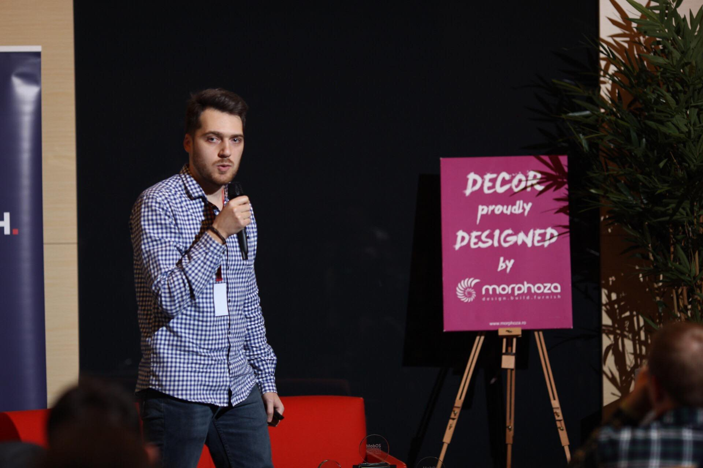

# Speaking

## Upcoming Talks

Ping [@dorindanciu](https://twitter.com/dorindanciu) on Twitter, or reach out via email (dorin at dorindanciu dot com) if you organize a conference where you'd like me to speak.

Location | Date | Conference
---------|------|------------
🌍|📆|⁉️

### Topics 2018

#### Jumpstarting localization using AppleGlot4

Have you ever localized your app for all the languages supported in the iOS environment? How many times along your career have you seen the same string translated over and over again? Have you released an open source framework that you've wished it had more translations? Whit the right setup, AppleGlot can help you resolve all these issues.

### Past Talks

Location | Date | Conference | Topic
---------|------|------------|-------
Cluj-Napoca, RO | February 15-16, 2018 | [MobOS 2018](http://romobos.com/blog/dorin-danciu-on-getting-to-know-siri) ([slides & source code](https://github.com/dorindanciu/keynotes/tree/master/MobOS2018)) | Getting to know Siri
Cluj-Napoca, RO | February 16-17, 2017 |  [MobOS 2017](http://romobos.com/blog/call-4-paper-results) ([slides & source code](https://github.com/dorindanciu/json-protoc-benchmark) | Benchmarks for Protobuf and JSON while using swift on both client and server side

### Slides

Most of my slides and resources are hosted on Github under [keynotes repository](https://github.com/dorindanciu/keynotes).

### Avatar

### Bio

> Dorin is an independent contractor dedicated to iOS mobile development. Since 2017 he runs Beilmo, an interactive studio that creates compelling mobile applications in Cluj-Napoca.

### Credits

Credits go to [Felix Krause](https://github.com/krausefx/speaking) and [Peter Steinberger](https://github.com/steipete/speaking) for coming up with this concept - thanks!
